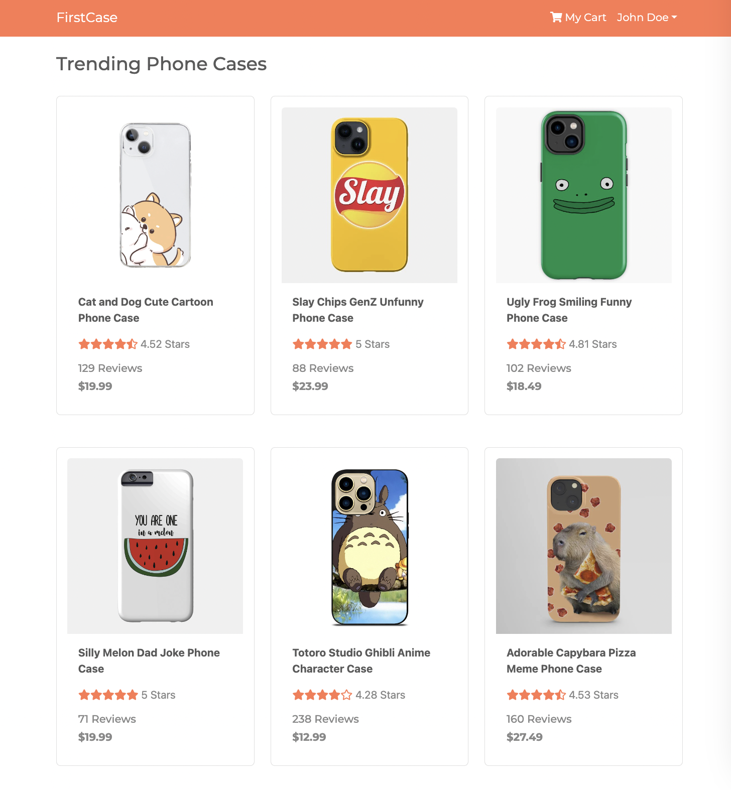
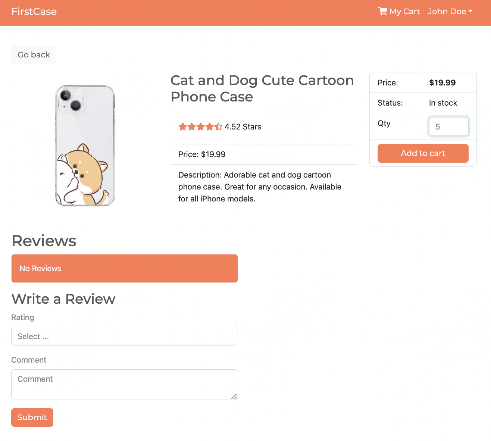
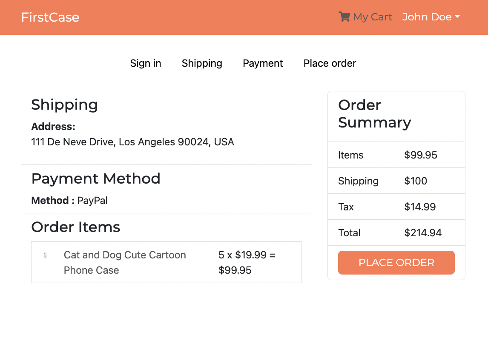

# FirstCase





A comprehensive online phone case sales platform built utilizing MERN and RESTful API.

## Tech Stack

- React.js
- Node.js
- Express.js
- MongoDB

## Features

- Shopping Cart and Ordering System
- Adaptive Product Layout
- User and Admin Profiles
- Registration / Login System
- Product Listing / Delisting
- Detailed Product Pages

Future Additions:
- Multiple Types of Products
- Fully Functional Payment Processor

## Installation

First, run ```npm install``` in both the cloned repo project root and in ```frontend/```.

Create a free mongodb database and then make a ```.env``` file in the project root like follows:

```
NODE_ENV = development
PORT = 5000
MONGO_URI = your_mongo_uri
JWT_SECRET = 'abc123'
```

Run ```npm import:data``` to populate the database.

Finally run ```npm run dev``` in root to launch the frontend and backend simultaneously.
